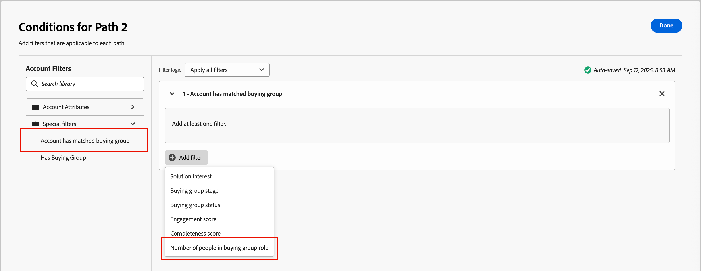

# 分割和合併路徑 {#split-paths}

使用分割與合併路徑節點，根據您定義的條件來劃分人員或帳戶。 根據條件建立對象或帳戶清單的路徑，使用區段的動作和事件節點定義每個路徑，然後組合路徑並繼續歷程。

{width="30"} [觀看概觀影片](#overview-video)

_分割路徑_&#x200B;節點會根據&#x200B;**__**&#x200B;帳戶或人員篩選器定義一或多個分段路徑。 根據人員篩選器的分割會使用合併路徑節點自動關閉，以便所有人員都可以前進到下一個步驟，而不會失去其帳戶內容。

>[!NOTE]
>
>最多支援25個路徑。

## 依帳戶分割路徑 {#split-paths-by-accounts}

**_（僅限帳戶歷程）_**

依帳戶分割路徑可包含帳戶和人員動作與事件。 這些路徑可以進一步分割。

_&#x200B;**依帳戶節點分割路徑的運作方式**&#x200B;_

* 您新增的每個路徑都包含一個能夠向每個邊緣新增節點的結束節點。
* 可巢狀方式依帳戶節點分割（您可以重複依帳戶分割路徑）。
* 每個路徑的評估方式都是從上到下。 如果帳戶符合第一和第二個路徑，則只沿著第一個路徑進行。
* 可使用合併節點來合併兩個或多個路徑。
* 節點支援&#x200B;_[!UICONTROL 其他帳戶]_&#x200B;路徑的定義，您可以在此為不符合其中一個已定義區段/路徑的帳戶新增動作或事件。

{width="700" zoomable="yes"}

### 帳戶路徑條件 {#account-path-filters}

| 路徑條件 | 說明 |
| --------------- | ----------- |
| [!UICONTROL 帳戶屬性] | 帳戶設定檔中的屬性，包括： <li>年收入 <li>城市 <li>國家 <li>員工規模 <li>行業 <li>名稱 <li>SIC 代碼 <li>狀態 |
| [!UICONTROL 自訂物件] >有`<custom object>` | [!BADGE Beta]{type=Informative tooltip="Beta功能"}此帳戶有或沒有關聯式結構描述記錄。 也可以根據[XDM關聯式結構描述](../admin/xdm-field-management.md#relational-schemas)中設定的任何選取的自訂物件條件進行評估。 （請參閱[自訂資料篩選](#custom-data-filtering)。） |
| [!UICONTROL 特殊篩選器] > [!UICONTROL 帳戶已符合購買群組] | 此帳戶符合一或多個購買群組。 您可以針對符合的購買群組，針對下列一或多個限制進行評估： <li>解決方案興趣 <li>購買群組階段 <li>購買群組狀態 <li>參與分數 <li>完整度分數 <li> 購買群組角色中的人員數 |

### 依帳戶節點新增分割路徑

1. 導覽至歷程圖。

1. 按一下路徑上的加號( **+** )圖示，然後選擇&#x200B;**[!UICONTROL 分割路徑]**。

   {width="300" zoomable="no"}

1. 在右側的節點屬性中，選擇&#x200B;**[!UICONTROL 帳戶]**&#x200B;進行分割。

1. 若要定義適用於&#x200B;_[!UICONTROL 路徑1]_&#x200B;的條件，請按一下&#x200B;**[!UICONTROL 套用條件]**。

   {width="500" zoomable="yes"}

1. 若要定義分割路徑，請在條件編輯器中新增一或多個篩選器。

   * 從左側導覽拖放篩選器屬性，並完成比對定義。

   * 在上方套用&#x200B;**[!UICONTROL 篩選邏輯]**，以精簡條件。 您選擇符合所有篩選器或任何篩選器。

     {width="700" zoomable="yes"}

   * 按一下「**[!UICONTROL 完成]**」。

1. 若要新增更多路徑，請按一下[新增路徑] **&#x200B;**，並重複先前步驟以新增適用於此路徑的條件。

   您也可以根據這些條件來標示每個路徑，或使用預設標籤。

1. 如有需要，請根據您想要分割的優先順序來重新排序路徑。

   路徑篩選是以由上到下的順序評估。 每個帳戶都會沿著第一個相符的路徑進行。

   按一下每個路徑卡片右上角的向上和向下箭頭，將其在路徑清單中向上或向下移動。

   {width="500" zoomable="yes"}

1. 啟用&#x200B;**[!UICONTROL 其他帳戶]**&#x200B;選項，為不符合所定義區段/路徑的帳戶定義預設路徑。

   未啟用此選項時，歷程會針對不符合分割內已定義區段/路徑的帳戶結束。

### 為帳戶購買群組篩選 {#buying-group-filtering-accounts}

您可以定義與購買群組相關之帳戶的路徑，並使用購買群組條件篩選路徑。 使用&#x200B;**[!UICONTROL 帳戶符合購買群組]**&#x200B;篩選器，以使用符合的購買群組定義路徑區段。 此篩選器也包含根據相符購買群組內指派角色數量來識別帳戶的選項。

例如，您可以根據不同角色中的深度（人數）來評估購買群組整備程度，例如三位決策者和兩位影響者。 在這種情況下，請將條件設定為目標客戶，在相符的購買群組中至少要有三(3)名決策者和兩(2)名影響者：

1. 按一下&#x200B;**[!UICONTROL 新增篩選器]**，然後選擇&#x200B;**[!UICONTROL 購買群組角色的人數]**&#x200B;篩選器。

   {width="700" zoomable="yes"}

1. 定義第一個角色引數。

   * 將人數評估設為`at least`，值為`3`。
   * 將角色評估設定為`is`，並從角色清單中選擇`Decision Maker`。

1. 重複步驟1以新增另一個購買群組角色引數。

1. 定義第二個角色引數。

   * 將人數評估設為`at least`，值為`2`。
   * 將角色評估設定為`is`，並從角色清單中選擇`Influencer`。

   {width="700" zoomable="yes"}提供角色深度的條件範例

1. 當您已為路徑定義所有條件時，請按一下&#x200B;**[!UICONTROL 完成]**。

針對已識別的帳戶，您可在路徑中新增動作節點，以更新購買群組或階段的狀態，或傳送銷售警示電子郵件。

## 依人員分割路徑

_（帳戶和人員歷程）_

依人員路徑分割只能包含人員動作。 這些路徑無法再次分割並自動聯結。

_&#x200B;**依人員節點分割路徑的運作方式**&#x200B;_

* 在&#x200B;_群組節點_&#x200B;分割合併組合中，依人員節點進行分割。 分割路徑會自動合併，以便所有人員能夠前進到下一個步驟，而不會失去其帳戶內容。
* 依人員節點分割無法巢狀（您無法在此群組節點內的路徑中為人員新增分割路徑）。
* 每個路徑的評估方式都是從上到下。 如果人員符合第一個和第二個路徑，則他們只會沿著第一個路徑前進。
* 此節點支援使用&#x200B;_帳戶 — 人員關係_，可讓您根據關係中定義的角色（例如約聘人員或全職員工）來篩選人員。
* 此節點支援&#x200B;_[!UICONTROL 其他人]_&#x200B;路徑的定義，您可以在此為不符合其中一個已定義區段/路徑的人員新增動作或事件。

{width="700" zoomable="yes"}

### 人員路徑篩選器 {#people-path-filters}

| 篩選器 | 說明 |
| ------------ | ----------- |
| [!UICONTROL 自訂物件] >有`<custom object>` | [!BADGE Beta]{type=Informative tooltip="Beta功能"}此人是否擁有關聯式結構描述記錄。 也可以根據[XDM關聯式結構描述](../admin/xdm-field-management.md#relational-schemas)中設定的任何選取的自訂物件條件進行評估。 （請參閱[自訂資料篩選](#custom-data-filtering)） |
| [!UICONTROL 事件歷史記錄] | 根據在歷程進入之前發生的體驗事件分割人員。 展開資料夾以檢視[管理員> XDM事件設定](../admin/configure-aep-events.md)中設定的所有事件型別，並選取一個新增為篩選器。 限制包括來自所選事件的欄位、從人員進入歷程時回溯的回顧時間範圍，以及選擇性的最小次數。 |
| [!UICONTROL 個人屬性] | [個人檔案](../admin/field-mapping.md#xdm-business-person-attributes)中的屬性，包括： <li>城市 <li>國家 <li>電子郵件地址 <li>電子郵件無效 <li>電子郵件中止 <li>名字 <li>推斷的州別區域 <li>職稱 <li>姓氏 <li>手機號碼 <li>個人參與分數 <li>電話號碼 <li>郵遞區號 <li>州別 |
| [!UICONTROL 特殊篩選器] > [!UICONTROL 購買團體成員] | 該人員是或不是根據下列一或多個條件評估的購買群組成員： <li>解決方案興趣</li><li>購買群組狀態</li><li>完整度分數</li><li>參與分數</li><li>已移除</li><li>角色</li> |
| [!UICONTROL 特殊篩選器] > [!UICONTROL 清單成員] | （已棄用）人員是否為一或多個[!DNL Marketo Engage]清單的成員。 |
| [!UICONTROL 特殊篩選器] > [!UICONTROL 計畫成員] | （已棄用）該人員是否為一個或多個[!DNL Marketo Engage]計畫的成員。 |

### Account-person路徑條件

| 路徑條件 | 說明 |
| --------------- | ----------- |
| 帳戶中的角色 | 此人是否在帳戶中被指派角色。 選擇性限制： <li>角色名稱 |

### 依人員節點新增分割路徑 {#add-a-split-path-by-people-node}

>[!NOTE]
>
>依人員分割路徑時，會自動插入&#x200B;_封閉分割路徑_&#x200B;節點以結束分割。 依人員分割的路徑只允許對人員節點&#x200B;_執行動作_。

1. 導覽至歷程圖。

1. 按一下路徑上的加號( **+** )圖示，然後選擇&#x200B;**[!UICONTROL 分割路徑]**。

   {width="300" zoomable="no"}

1. 在右側的節點屬性中，選擇&#x200B;**[!UICONTROL 人員]**&#x200B;進行分割。

1. （僅限帳戶歷程）設定用於條件&#x200B;**的**&#x200B;屬性。

   * 選擇&#x200B;**[!UICONTROL 僅人員屬性]**&#x200B;以使用與人員設定檔相關的條件。
   * 選擇&#x200B;**[!UICONTROL 僅限帳號 — 個人屬性]**&#x200B;以使用帳號中與個人角色成員資格相關的條件。

1. 若要定義適用於&#x200B;_[!UICONTROL 路徑1]_&#x200B;的條件，請按一下&#x200B;**[!UICONTROL 套用條件]**。

1. 在條件編輯器中，新增一或多個篩選器以定義分割路徑。

   * 從左側導覽拖放任何人員篩選器，並完成相符定義。

     >[!NOTE]
     >
     >如果您已在 Experience Platform 的帳戶客群結構描述中定義了自訂人員欄位，則這些欄位也可做為條件中的人員屬性。

   * 在上方套用&#x200B;**[!UICONTROL 篩選邏輯]**，以精簡條件。 您可以選擇符合所有屬性條件或任何條件。

     {width="700" zoomable="yes"}

   * 按一下「**[!UICONTROL 完成]**」。

1. 若要新增更多路徑，請按一下[新增路徑] **&#x200B;**，並重複先前步驟以新增適用於此路徑的條件。

   您也可以根據這些條件來標示每個路徑，或使用預設標籤。

1. 如有需要，請根據您想要分割的優先順序來重新排序路徑。

   路徑篩選是以由上到下的順序評估。 每個人都會沿著第一個符合的路徑前進。

   按一下每個路徑卡片右上角的向上和向下箭頭，將其在路徑清單中向上或向下移動。

   {width="500" zoomable="yes"}

1. 啟用&#x200B;**[!UICONTROL 其他人]**&#x200B;選項，為不符合所定義路徑的人新增預設路徑。

   未啟用此選項時，不符合已定義區段/路徑的訪客會經過分割，繼續歷程的下一個步驟。

   當您針對在人員層級上分割對象的每個路徑定義條件時，您可以新增要對人員採取的動作。

### 體驗事件歷史記錄篩選 {#experience-event-history-filtering}

針對依人員分割的路徑，您可以根據人員進入歷程前發生的體驗事件來定義路徑。 在條件編輯器中，展開&#x200B;**[!UICONTROL Event history]**&#x200B;資料夾以檢視管理員所設定的所有事件型別清單。 選取事件型別，將其新增為篩選條件。

事件歷程的回顧時間範圍是從人員進入歷程的那一刻開始往後測量。 例如，30天視窗會評估合格事件是否發生在歷程專案之前30天內。

您可以使用所選事件欄位專用的限制來進一步縮小篩選範圍。 選用的活動&#x200B;**限制的**&#x200B;[!UICONTROL &#x200B;最小次數&#x200B;]&#x200B;**和**&#x200B;日期都在定義的回顧期間內評估。 由於事件記錄資料是從Adobe Experience Platform同步的，因此此篩選器在最近發生的事件顯示之前，可能會有短暫的延遲。

>[!NOTE]
>
>[!UICONTROL 事件歷史記錄]資料夾中可用的事件由[體驗事件和欄位設定](../admin/configure-aep-events.md)決定。

**範例：**&#x200B;若要路由在進入歷程之前點按行銷電子郵件中連結的人，請從[!UICONTROL 事件歷史記錄]資料夾中選取電子郵件點按事件，設定回溯時段以涵蓋相關時段，並視需要套用任何欄位層級限制（例如特定連結URL）。

{width="700" zoomable="yes"}

>[!BEGINSHADEBOX 「非使用中篩選」]

針對每個&#x200B;_[!UICONTROL 事件歷史記錄]_&#x200B;篩選器，您可以啟用&#x200B;**[!UICONTROL 切換到非使用狀態篩選器]**&#x200B;選項。 此選項會將篩選器變更為缺少該活動型別的評估。 例如，新增&#x200B;_[!UICONTROL 開啟的直銷電子郵件]_&#x200B;篩選器，以建立&#x200B;_&#x200B;**未**&#x200B;_&#x200B;開啟電子郵件之人員的路徑。 啟用非使用狀態選項並指定電子郵件。

{width="700" zoomable="yes"}

>[!ENDSHADEBOX]

### 成員資格篩選

在&#x200B;_[!UICONTROL 特殊篩選器]_&#x200B;區段中，有多個篩選器可用來評估購買群組或[!DNL Marketo Engage]清單中的成員資格。

例如，如果您想要為購買群組成員且被指派特定角色的人建立路徑，請新增&#x200B;_[!UICONTROL 特殊篩選器]_ > _[!UICONTROL 購買群組成員]_&#x200B;篩選器。 針對篩選，將成員資格設為&#x200B;_true_，選取與一個或多個購買群組相關聯的&#x200B;_[!UICONTROL 方案興趣]_，並設定您要比對的&#x200B;_[!UICONTROL 角色]_。

{width="700" zoomable="yes"}

您也可以包含其他購買群組成員資格限制：

* _[!UICONTROL 購買團體階段]_
* _[!UICONTROL 購買群組狀態]_
* _[!UICONTROL 完整性分數]_
* _[!UICONTROL 參與分數]_
* _[!UICONTROL 已移除]_

>[!TIP]
>
>若要排除從購買群組移除的成員，請使用&#x200B;_[!UICONTROL Is Removed]_&#x200B;條件約束設為`false`。 您也可以將此限制設定為`true`，明確包含已移除的成員。

>[!BEGINSHADEBOX 「Marketo Engage清單和計畫會籍」]

在[!DNL Marketo Engage]中，_智慧行銷活動_&#x200B;會檢查方案的成員資格，以確保潛在客戶不會收到重複的電子郵件，而且不會同時成為多個電子郵件串流的成員。 在Journey Optimizer B2B中，您可以檢查[!DNL Marketo Engage]清單成員資格以作為依人員分割路徑的條件，以協助消除歷程活動中的重複。

若要在分割條件中使用清單成員資格，請展開&#x200B;**[!UICONTROL 特殊篩選器]**，並將&#x200B;**[!UICONTROL 清單成員]**&#x200B;或&#x200B;**[!UICONTROL 方案成員]**&#x200B;條件拖曳到篩選器空間。 完成篩選定義以評估一或多個[!DNL Marketo Engage]清單中的成員資格。

![依人員條件分割[!DNL Marketo Engage]清單成員資格的路徑](./assets/node-split-paths-conditions-people-member-of-list.png){width="700" zoomable="yes"}
 

>[!NOTE]
>
>**功能淘汰**  
>
>在目前的Journey Optimizer B2B edition版本中，不支援根據Marketo Engage執行個體中的清單或方案成員資格進行篩選。

>[!ENDSHADEBOX]

## 自訂資料篩選 {#custom-data-filtering}

[!BADGE Beta]{type=Informative tooltip="Beta功能"}

您可以使用關聯式結構描述（以模型為基礎的類別），依帳戶或人員分割路徑。 自訂物件是在&#x200B;_關聯式結構描述_&#x200B;中定義，產品管理員可以在[!DNL Journey Optimizer B2B Edition]中[設定關聯式結構描述欄位](../admin/xdm-field-management.md#relational-schemas)。 條件編輯器中可使用選取的結構描述欄位，用於&#x200B;_依帳戶分割路徑_&#x200B;和&#x200B;_依人員分割路徑_&#x200B;節點。

若要依帳戶&#x200B;**分割**&#x200B;[!UICONTROL &#x200B;路徑或依人員&#x200B;]&#x200B;**分割**&#x200B;路徑，請展開&#x200B;_[!UICONTROL 自訂物件]_。 新增條件並將值設定為`true`或`false`。 按一下&#x200B;**[!UICONTROL 新增限制]**&#x200B;以使用欄位值進行篩選。

{width="600" zoomable="yes"}

## 合併路徑 {#merge-paths}

新增&#x200B;_合併路徑_&#x200B;節點以在您的歷程中結合不同的帳戶&#x200B;_分割路徑_。

1. 在含有分割節點（具有三個或更多路徑）的歷程地圖中，為每個路徑新增動作和事件組合。

1. 按一下任一路徑的加號( **+** )圖示，然後從顯示的選項中選擇&#x200B;**[!UICONTROL 合併]**。

   {width="400" zoomable="no"}

1. 在合併路徑節點屬性中，選取您要合併的路徑。

   {width="600" zoomable="yes"}

   此時，路徑會合併，以便來自所選路徑的帳戶合併為單一路徑，繼續完成歷程。

1. 如有需要，您可以導覽回合併路徑節點屬性，並清除您要移除之任何路徑的核取方塊，以取消合併路徑。

## 概觀影片 {#overview-video}

>[!VIDEO](https://video.tv.adobe.com/v/3443231/?learn=on)
