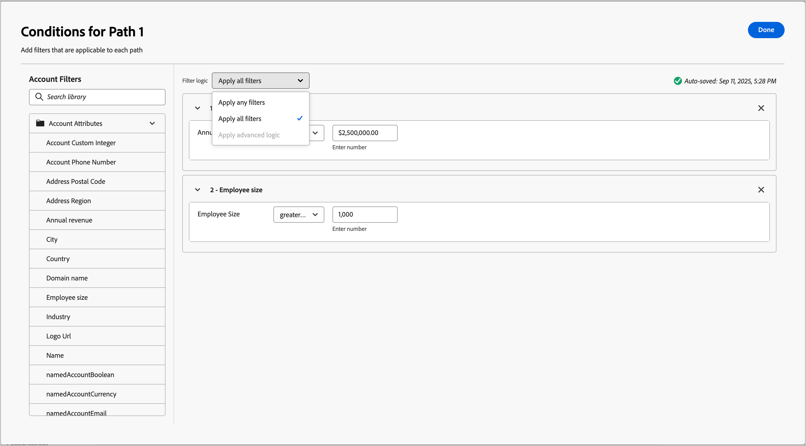

# 分割和合併路徑

使用分割與合併路徑節點，根據您定義的條件來劃分人員或帳戶。 根據條件建立對象或帳戶清單的路徑，使用區段的動作和事件節點定義每個路徑，然後組合路徑並繼續歷程。

{width="30"} [觀看概觀影片](#overview-video)

_分割路徑_&#x200B;節點會根據&#x200B;**__**&#x200B;帳戶或人員篩選器定義一或多個分段路徑。 根據人員篩選器的分割會使用合併路徑節點自動關閉，以便所有人員都可以前進到下一個步驟，而不會失去其帳戶內容。

>[!NOTE]
>
>最多支援25個路徑。

## 依帳戶分割路徑

依帳戶分割路徑可包含帳戶和人員動作與事件。 這些路徑可以進一步分割。

_&#x200B;**依帳戶節點分割路徑的運作方式**&#x200B;_

* 您新增的每個路徑都包含一個能夠向每個邊緣新增節點的結束節點。
* 可巢狀方式依帳戶節點分割（您可以重複依帳戶分割路徑）。
* 每個路徑的評估方式都是從上到下。 如果帳戶符合第一和第二個路徑，則只沿著第一個路徑進行。
* 可使用合併節點來合併兩個或多個路徑。
* 節點支援&#x200B;_[!UICONTROL 其他帳戶]_&#x200B;路徑的定義，您可以在此為不符合其中一個已定義區段/路徑的帳戶新增動作或事件。

{width="700" zoomable="yes"}

### 帳戶路徑條件

| 路徑條件 | 說明 |
| --------------- | ----------- |
| 帳戶屬性 | 帳戶設定檔中的屬性，包括： <li>年收入 <li>城市 <li>國家/地區 <li>員工人數 <li>行業 <li>名稱 <li>SIC代碼 <li>狀態 |
| [!UICONTROL 特殊篩選器] > [!UICONTROL 有購買群組] | 帳戶是否擁有購買群組的成員。 您也可以根據下列一或多個條件進行評估： <li>解決方案興趣 <li>購買群組狀態 <li>完整度分數 <li>參與分數 |

### 依帳戶節點新增分割路徑

1. 導覽至歷程圖。

1. 按一下路徑上的加號( **+** )圖示，然後選擇&#x200B;**[!UICONTROL 分割路徑]**。

   {width="300"}

1. 在右側的節點屬性中，選擇&#x200B;**[!UICONTROL 帳戶]**&#x200B;進行分割。

1. 若要定義適用於&#x200B;_[!UICONTROL 路徑1]_&#x200B;的條件，請按一下&#x200B;**[!UICONTROL 套用條件]**。

   {width="500"}

1. 在條件編輯器中，新增一或多個篩選器以定義分割路徑。

   * 從左側導覽拖放篩選器屬性，並完成比對定義。

   * 在上方套用&#x200B;**[!UICONTROL 篩選邏輯]**，微調條件。 您可以選擇符合所有屬性條件或任何條件。

     {width="700" zoomable="yes"}

   * 按一下「**[!UICONTROL 完成]**」。

1. 若要新增更多路徑，請按一下[新增路徑] **&#x200B;**，並重複先前步驟以新增適用於此路徑的條件。

   您也可以根據這些條件來標示每個路徑，或使用預設標籤。

1. 如有需要，請根據您想要分割的優先順序來重新排序路徑。

   路徑篩選是以由上到下的順序評估。 每個帳戶都會沿著第一個相符的路徑進行。

   按一下每個路徑卡片右上角的向上和向下箭頭，將其在路徑清單中向上或向下移動。

   {width="500" zoomable="yes"}

1. 啟用&#x200B;**[!UICONTROL 其他帳戶]**&#x200B;選項，為不符合所定義區段/路徑的帳戶定義預設路徑。

   未啟用此選項時，歷程會針對不符合分割內已定義區段/路徑的帳戶結束。

## 依人員分割路徑

依人員路徑分割只能包含人員動作。 這些路徑無法再次分割並自動聯結。

_&#x200B;**依人員節點分割路徑的運作方式**&#x200B;_

* 在&#x200B;_群組節點_&#x200B;分割合併組合中，依人員節點進行分割。 分割路徑會自動合併，以便所有人員能夠前進到下一個步驟，而不會失去其帳戶內容。
* 依人員節點分割無法巢狀（您無法在此群組節點內的路徑中為人員新增分割路徑）。
* 每個路徑的評估方式都是從上到下。 如果人員符合第一個和第二個路徑，則他們只會沿著第一個路徑前進。
* 此節點支援使用&#x200B;_帳戶 — 人員關係_，可讓您根據關係中定義的角色（例如約聘人員或全職員工）來篩選人員。
* 此節點支援&#x200B;_[!UICONTROL 其他人]_&#x200B;路徑的定義，您可以在此為不符合其中一個已定義區段/路徑的人員新增動作或事件。

{width="700" zoomable="yes"}

### 人員路徑條件

| 路徑條件 | 說明 |
| --------------- | ----------- |
| [!UICONTROL 活動歷史記錄] > [!UICONTROL 電子郵件] | 根據條件評估的電子郵件活動，這些條件使用一或多個所選歷程中先前位置的電子郵件訊息： <li>[!UICONTROL 已點按電子郵件中的連結] <li>已開啟的電子郵件 <li>已傳遞電子郵件 <li>已傳送電子郵件 **[!UICONTROL 切換到非使用中篩選&#x200B;]**— 使用此選項來根據缺少活動篩選（某人沒有電子郵件活動）。 |
| [!UICONTROL 活動歷史記錄] > [!UICONTROL 簡訊訊息] | 根據條件評估的SMS活動使用一或多個從歷程中先前選取的SMS訊息進行： <li>[!UICONTROL 已點按簡訊中的連結] <li>[!UICONTROL 簡訊已退回]  **[!UICONTROL 切換到非活動篩選器&#x200B;]**— 使用此選項來根據缺少活動進行篩選（某人沒有簡訊活動）。 |
| [!UICONTROL 活動歷史記錄] > [!UICONTROL 資料值已變更] | 針對選取的人員屬性，發生值變更。 這些變更型別包括： <li>新值<li>上一個值<li>原因<li>來源<li>活動日期<li>最低 次數 **[!UICONTROL 切換到非使用狀態篩選器&#x200B;]**— 使用此選項來根據缺少活動進行篩選（人員沒有資料值變更）。 |
| [!UICONTROL 活動歷史記錄] > [!UICONTROL 有趣的時刻] | 在關聯的Marketo Engage例項中定義的有趣時刻活動。 限制包括： <li>里程碑<li>電子郵件<li>網頁 **[!UICONTROL 切換到非活動篩選器&#x200B;]**— 使用此選項來根據缺少活動進行篩選（某人沒有有趣的時刻）。 |
| [!UICONTROL 活動歷史記錄] > [!UICONTROL 造訪的網頁] | 針對由相關Marketo Engage例項管理的一或多個網頁的網頁活動。 限制包括： <li>網頁（必填）<li>活動日期<li>使用者端IP位址 <li>Querystring <li>反向連結 <li>使用者代理 <li>搜尋引擎 <li>搜尋查詢 <li>個人化URL <li>權杖 <li>瀏覽器 <li>平台 <li>裝置 <li>最低 次數 **[!UICONTROL 切換到非使用狀態篩選器&#x200B;]**— 使用此選項來根據缺少使用狀態進行篩選（某人未造訪網頁）。 |
| [!UICONTROL 個人屬性] | 個人設定檔中的屬性，包括： <li>城市 <li>國家/地區 <li>出生日期 <li>電子郵件地址 <li>電子郵件無效 <li>電子郵件已暫停 <li>名字 <li>推斷的狀態區域<li>職稱 <li>姓氏 <li>行動電話號碼 <li>個人參與分數 <li>電話號碼 <li>郵遞區號 <li>狀態 <li>已取消訂閱 <li>取消訂閱的原因 |
| [!UICONTROL 特殊篩選器] > [!UICONTROL 購買團體成員] | 該人員是或不是根據下列一或多個條件評估的購買群組成員： <li>解決方案興趣</li><li>購買群組狀態</li><li>完整度分數</li><li>參與分數</li><li>角色</li> |
| [!UICONTROL 特殊篩選器] > [!UICONTROL 清單成員] | 此人是否為一或多個Marketo Engage清單的成員。 |
| [!UICONTROL 特殊篩選器] > [!UICONTROL 計畫成員] | 此人是否為一或多個Marketo Engage方案的成員。 |

### Account-person路徑條件

| 路徑條件 | 說明 |
| --------------- | ----------- |
| 帳戶[!UICONTROL 中的]角色 | 此人是否在帳戶中被指派角色。 選擇性限制： <li>角色名稱 |

### 依人員節點新增分割路徑

>[!NOTE]
>
>依人員分割路徑時，會自動插入&#x200B;_封閉分割路徑_&#x200B;節點以結束分割。 依人員分割的路徑只允許對人員節點&#x200B;_執行動作_。

1. 導覽至歷程圖。

1. 按一下路徑上的加號( **+** )圖示，然後選擇&#x200B;**[!UICONTROL 分割路徑]**。

   {width="300"}

1. 在右側的節點屬性中，選擇&#x200B;**[!UICONTROL 人員]**&#x200B;進行分割。

1. 設定用於條件&#x200B;**[!UICONTROL 的]**&#x200B;屬性。

   * 選擇&#x200B;**[!UICONTROL 僅人員屬性]**&#x200B;以使用與人員設定檔相關的條件。
   * 選擇&#x200B;**[!UICONTROL 僅限帳號 — 個人屬性]**&#x200B;以使用帳號中與個人角色成員資格相關的條件。

1. 若要定義適用於&#x200B;_[!UICONTROL 路徑1]_&#x200B;的條件，請按一下&#x200B;**[!UICONTROL 套用條件]**。

1. 在條件編輯器中，新增一或多個篩選器以定義分割路徑。

   * 從左側導覽拖放任何人員屬性，並完成比對定義。

     >[!NOTE]
     >
     >如果您在Experience Platform的帳戶對象結構描述中定義了自訂人員欄位，這些欄位也可在條件中作為人員屬性使用。

   * 在上方套用&#x200B;**[!UICONTROL 篩選邏輯]**，微調條件。 您可以選擇符合所有屬性條件或任何條件。

     {width="700" zoomable="yes"}

   * 按一下「**[!UICONTROL 完成]**」。

1. 若要新增更多路徑，請按一下[新增路徑] **&#x200B;**，並重複先前步驟以新增適用於此路徑的條件。

   您也可以根據這些條件來標示每個路徑，或使用預設標籤。

1. 如有需要，請根據您想要分割的優先順序來重新排序路徑。

   路徑篩選是以由上到下的順序評估。 每個人都會沿著第一個符合的路徑前進。

   按一下每個路徑卡片右上角的向上和向下箭頭，將其在路徑清單中向上或向下移動。

   {width="500" zoomable="yes"}

1. 啟用&#x200B;**[!UICONTROL 其他人]**&#x200B;選項，為不符合所定義路徑的人新增預設路徑。

   未啟用此選項時，不符合已定義區段/路徑的人員會經過分割，並繼續歷程中的下一個步驟。

   當您針對在人員層級上分割對象的每個路徑定義條件時，您可以新增要對人員採取的動作。

### 活動篩選

針對依人員分割的路徑，您可以根據與下列專案相關之人員的活動來定義路徑：

* 歷程中先前位置的電子郵件訊息
* 歷程中先前位置的SMS訊息
* 個人設定檔中資料值的變更
* 與電子郵件、網頁或里程碑相關的有趣時刻(在Marketo Engage中追蹤)
* 造訪在Marketo Engage中追蹤的網頁

>[!BEGINSHADEBOX 「非使用中篩選」]

您可以針對每個&#x200B;_[!UICONTROL 活動歷史記錄]_&#x200B;篩選器，啟用&#x200B;**[!UICONTROL 切換至非活動篩選器]**&#x200B;選項。 此選項會將篩選器變更為缺少該活動型別的評估。 例如，如果您想要建立&#x200B;_&#x200B;**未**&#x200B;_&#x200B;開啟歷程中先前電子郵件之人員的路徑，請新增&#x200B;_[!UICONTROL 電子郵件]_ > _[!UICONTROL 已開啟電子郵件]_&#x200B;篩選器。 啟用非使用狀態選項並指定電子郵件。 最佳實務是使用活動的&#x200B;_[!UICONTROL 日期]_&#x200B;限制來定義非活動的時段。

{width="700" zoomable="yes"}

>[!ENDSHADEBOX]

### 成員資格篩選

在&#x200B;_[!UICONTROL 特殊篩選器]_&#x200B;區段中，有多個篩選器可用來評估購買群組或Marketo Engage清單中的成員資格。 例如，如果您想要為購買群組成員且被指派特定角色的人建立路徑，請新增&#x200B;_[!UICONTROL 特殊篩選器]_ > _[!UICONTROL 購買群組成員]_&#x200B;篩選器。 針對篩選，將成員資格設為&#x200B;_true_，選取與一個或多個購買群組相關聯的&#x200B;_[!UICONTROL 方案興趣]_，並設定您要比對的&#x200B;_[!UICONTROL 角色]_。

{width="700" zoomable="yes"}

>[!BEGINSHADEBOX 「Marketo Engage清單成員資格」]

在Marketo Engage中，_智慧行銷活動_&#x200B;會檢查方案成員資格，以確保潛在客戶不會收到重複的電子郵件，而且不會同時成為多個電子郵件串流的成員。 在Journey Optimizer B2B中，您可以檢查Marketo Engage清單成員資格，並以此作為依人員分割路徑的條件，以協助消除歷程活動中的重複。

若要在分割條件中使用清單成員資格，請展開&#x200B;**[!UICONTROL 特殊篩選器]**，並將&#x200B;**[!UICONTROL 清單成員]**&#x200B;條件拖曳到篩選器空間。 完成篩選器定義以評估一或多個Marketo Engage清單中的成員資格。

{width="700" zoomable="yes"}

>[!ENDSHADEBOX]

## 合併路徑

新增&#x200B;_合併路徑_&#x200B;節點以在您的歷程中依帳戶結合不同的分割路徑。

1. 導覽至歷程圖。

1. 按一下路徑上的加號( **+** )圖示，然後選擇&#x200B;**[!UICONTROL 分割路徑]**。

1. 按一下分割節點以開啟其右側屬性。

1. 按一下[!UICONTROL 新增路徑]以建立三個路徑。

1. 將動作和事件的組合新增至每個路徑。

1. 按一下任一路徑的加號( **+** )圖示，然後從顯示的選項中選擇&#x200B;**[!UICONTROL 合併]**。

   {width="400"}

1. 在合併路徑節點屬性中，選取您要合併的路徑。

   {width="600" zoomable="yes"}

   此時，路徑會合併，以便來自所選路徑的帳戶合併為單一路徑，繼續完成歷程。

1. 如有需要，您可以導覽回合併路徑節點屬性，並清除您要移除之任何路徑的核取方塊，以取消合併路徑。

## 概觀影片

>[!VIDEO](https://video.tv.adobe.com/v/3443267/?learn=on&captions=chi_hant)
