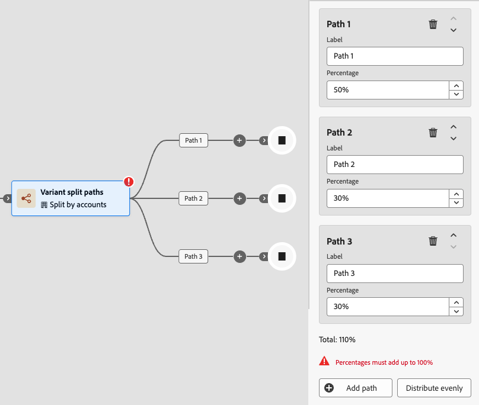

# 變體分割路徑

使用&#x200B;_變體分割路徑_&#x200B;節點，根據您定義的百分比配置，將帳戶隨機分配至兩個或多個歷程路徑。 此節點適合用於探索性測試帳戶對象區段之間的不同訊息、時間或參與策略，而不套用條件規則。 它不適用於需要為每個帳戶指派一致路徑的受控A/B實驗。

>[!AVAILABILITY]
>
>變體分割路徑節點目前可供選取客戶作為有限測試版使用，僅適用於&#x200B;**_帳戶歷程_**。 計畫在未來版本支援個人歷程。 若要取得存取權，請聯絡您的Adobe代表。

## 與分割路徑比較 {#compare-split-paths}

_[分割路徑](./split-merge-paths-nodes.md)_&#x200B;和&#x200B;_變體分割路徑_&#x200B;都會將帳戶分割為多個歷程分支，但它們使用不同的機制：

| 外觀 | 分割路徑 | 變體分割路徑 |
| -------- | ----------- | ------------------- |
| **指派邏輯** | _條件式規則型_ — 每個帳戶都依據定義的條件進行評估，並沿著其符合的第一個路徑進行。 | _以百分比為基礎的隨機指派_ — 帳戶會根據設定的百分比（沒有篩選條件）分散到各個路徑。 |
| **決定式** | _決定性_ — 只要符合相同的條件，相同的帳戶永遠遵循相同的路徑。 | 非決定性 — 相同的帳戶在重新進入時可能會遵循不同的路徑。 |
| **使用案例** | 依已知帳戶或購買群組屬性分段；依優先順序的評估。 | 在您的帳戶對象中隨機分配帳戶，以測試訊息、時間或戰術。 |
| **其他帳戶路徑** | _支援_ — 可將不符合任何已定義路徑的帳戶路由至預設路徑。 | _不適用_ — 每個帳戶都被指派給其中一個已定義的路徑。 |

## 依帳戶分割 {#split-by-account}

當帳戶到達變體分割路徑節點時，該節點會根據設定的百分比，將其指派給正好一個路徑。 此指派使用配額型演演算法，追蹤已指派給每個路徑的帳戶數量，並隨時間調整以維持設定的比率。

* 每個帳戶只會指派給一個路徑。
* 指派是隨機且以配額為基礎。 演演算法會動態調整分配，以接近整個母體的已設定百分比。
* 節點支援2到20個路徑。 每個路徑都有可設定的名稱和介於1到99的整數百分比。 所有路徑百分比的總和必須等於100%。

>[!IMPORTANT]
>
>**配額型演演算法：非決定性**
>
>分佈演演算法使用配額型隨機指派。 此演演算法是&#x200B;**_非決定性_**：每次進入或重新進入歷程時，可將相同的帳戶指派給不同的路徑。 路徑指派取決於評估時目前的配額狀態，而不是固定帳戶屬性。 請參閱[限制](#limitations)，以取得此影響之使用案例的詳細資訊。

### 分佈演演算法 {#distribution-algorithm}

變體分割路徑節點使用&#x200B;**_配額型隨機指派_**&#x200B;演演算法。 當帳戶到達節點時，系統會評估每個路徑的現有帳戶指派，並將帳戶路由至其設定配額下最遠的路徑。 演演算法有兩個關鍵屬性：

* 分佈會密切追蹤所有帳戶磁碟區的設定百分比。 因為演演算法會主動維護配額計數，所以當總計未平均分割時，由於四捨五入，實際分配只會依每個路徑最多一個帳戶而有所不同。
* 此演演算法會在配額評估期間使用悲觀鎖定來序列化指派，以確保在並行執行時進行準確的計數追蹤。

### 限制 {#limitations}

在歷程中使用變體分割路徑之前，請先檢閱這些限制。

>[!CAUTION]
>
>**路徑指派不是決定性的。**
>
>配額型演演算法無法保證相同的帳戶永遠遵循相同的路徑。 如果帳戶退出並重新進入歷程，即會根據重新進入時的配額狀態，將其指派給不同的路徑。 對於需要在歷程執行個體間進行一致的每個帳戶路徑指派的使用案例，請勿使用變體分割路徑。

| 限制 | 說明 |
| ---------- | ----------- |
| **不適用於受控實驗** | 因為路徑指派不是決定性的，所以變體分割路徑是&#x200B;**不適合**，不適合需要指定帳戶一致接受相同處理的A/B實驗或歸因案例。 取決於個別帳戶一致性的使用案例（例如衡量回應率或將結果歸因於特定體驗）可能會產生不可靠的結果。 |
| **小舍入偏移** | 當設定的百分比無法平均分配總帳戶數時，每個路徑最多只能有一個帳戶關閉分配。 這是預期的舍入行為，不是錯誤。 |
| **路徑指派不是等冪** | 重新進入歷程可能會為相同帳戶產生不同的路徑指派。 如果您的歷程設計假設帳戶在分割節點後一律遵循相同路徑，則此假設不成立。 |
| **僅限帳戶歷程** | 僅帳戶歷程支援變體分割路徑。 目前不支援個人歷程。 |
| **沒有條件式篩選** | 不同於&#x200B;_分割路徑_，變體分割路徑不套用條件。 到達節點的每個帳戶都會指派到一個路徑。 |

## 依人員分割 {#split-by-people}

在帳戶歷程中，您也可以使用變異式分割路徑節點，將帳戶&#x200B;_內的_&#x200B;個人隨機分佈到以百分比為基礎的路徑中。 當您想要在人員層級測試不同的內容或體驗時（因為帳戶會繼續經過歷程），此分割型別會很有用。 依人員節點的變體分割路徑操作有以下護欄：

* 該節點的作用為&#x200B;_群組節點_，這是分割合併組合。 分割路徑會在對應的合併節點自動關閉，以便所有人員可以在不失去帳戶內容的情況下前進。
* 根據設定的百分比，帳戶中的每個人只會獲派一個路徑。
* 適用於帳戶的配額演演算法同樣適用於人員。 路徑指派不是決定性的，同一個人在重新進入時可能會遵循不同的路徑。
* 路徑中只支援人員的&#x200B;_[!UICONTROL 採取動作]_&#x200B;節點。 路徑無法進一步分割。

>[!BEGINSHADEBOX 「跨人員的分發行為」]

帳戶內的人員會以批次處理。 指派給每個路徑的號碼會計算為`floor(percentage / 100 × people_in_account)`，而&#x200B;**上次設定的路徑會接收所有剩餘的人員**。 這表示:

* 當帳戶具有奇數人數時，最後一個路徑會比先前的路徑多接收一個使用者。
* 若帳戶只有單一人員，無論設定的百分比為何，都會將該人員指派給第一個路徑。
* 若為很少人（少於10人）的帳戶，每個帳戶的分佈可能會與設定的百分比有明顯差異。 跨多個帳戶測量時，分佈會收斂於設定的比率。

>[!NOTE]
>
>此舍入行為適用於每個帳戶批次，不適用於歷程中的所有帳戶。 當帳戶大小為奇怪時，最後一個路徑系統性地接收到的人數略多於設定人數。 這是預期行為。

>[!ENDSHADEBOX]

## 新增變體分割路徑節點 {#add-variant-split-paths-node}

1. 導覽至歷程圖。

1. 按一下路徑上的加號( **+** )圖示，然後選擇&#x200B;**[!UICONTROL 變體分割路徑]**。

   {width="300" zoomable="no"}

   新增的節點有兩個路徑要開始。

1. 在右側的節點屬性中，選擇&#x200B;**[!UICONTROL 帳戶]**&#x200B;或&#x200B;**[!UICONTROL 人員]**&#x200B;以進行分割。

   如果您使用&#x200B;_[!UICONTROL 人員]_&#x200B;型別，系統會自動插入&#x200B;_關閉變數分割路徑_&#x200B;節點，以關閉群組分割。

   {width="700" zoomable="yes"}

1. 檢閱或更新每個路徑的&#x200B;**[!UICONTROL 標籤]**。

   路徑標籤會以邊緣標籤的形式出現在歷程畫布上，有助於區分Journey Analytics中的路徑。

   {width="600" zoomable="yes"}

1. 設定每個路徑的&#x200B;**[!UICONTROL 百分比]**。

   值必須是1到99的整數。

   {width="500" zoomable="yes"}

   執行總計指示器會顯示所有路徑百分比的總和。 總數必須剛好等於100%，您才能發佈歷程。 當總計不等於100%時會顯示錯誤狀態。

   {width="500" zoomable="yes"}

   若要將百分比平均分配到所有路徑，請按一下[平均分配] ****。 系統會計算相等的份額並調整任何舍入，以確保總計等於100%。

1. 若要定義其他路徑，請按一下每個路徑的&#x200B;**[!UICONTROL 新增路徑]**。

   節點最多可支援20個路徑。 新增更多路徑時，請調整&#x200B;_[!UICONTROL 百分比]_，讓總數等於100%。

   您可以按一下路徑卡中的&#x200B;_刪除_ （  ）圖示來移除路徑。 只有在至少保留兩個路徑時，才能移除路徑。

### 驗證規則 {#validation-rules}

下列規則適用於變體分割路徑設定。 違規會封鎖歷程發佈。

| 規則 | 需求 |
| ---- | ----------- |
| 最小路徑 | 2 |
| 路徑數上限 | 20 |
| 每個路徑的百分比 | 1到99的整數 |
| 總計百分比 | 必須等於100% |
