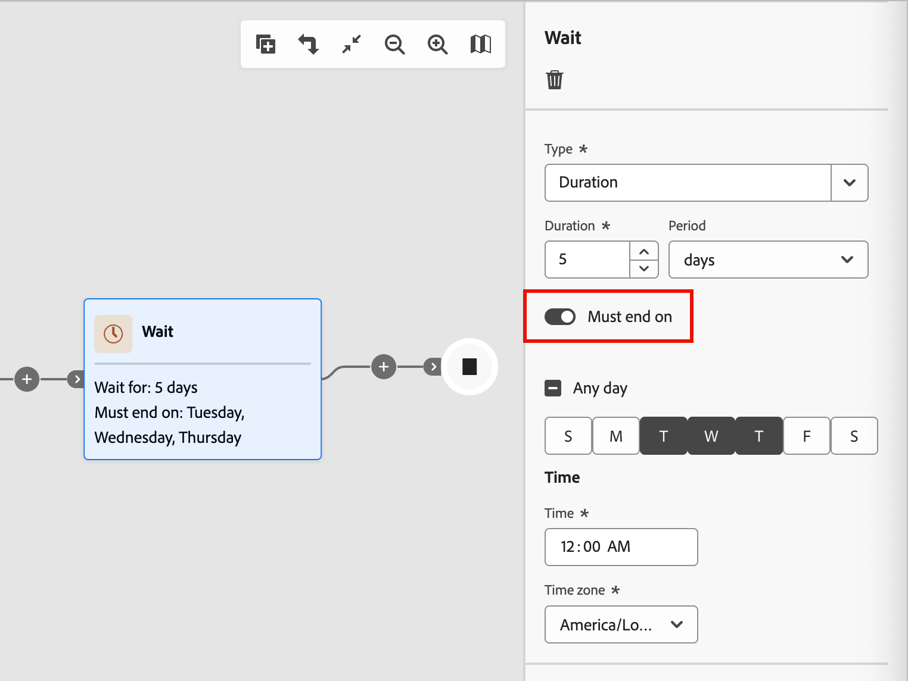

# 等待節點

當您想要在移到下一個步驟之前暫停歷程進行特定期間時，請使用&#x200B;_等待_&#x200B;節點。

定義等待時間的方式有兩種：

* 您要前進到歷程中下一個節點的特定日期
* 相對持續時間（分鐘數、小時數、天數、周數或月數）

## 新增等待節點

1. 導覽至歷程圖。

1. 按一下路徑上的加號( **+** )圖示，然後選擇&#x200B;**[!UICONTROL 等待]**。

   {width="440"}

1. 在右側的節點屬性中，設定在歷程繼續前往路徑中的下一個節點之前等待的時間的&#x200B;**[!UICONTROL 型別]**。

   * **[!UICONTROL 持續時間]** — 定義從進入到結束等待節點之間要經過的特定天數、小時數或分鐘數。
   * **[!UICONTROL 日期]** — 指定結束的特定日期和時間。

   {width="500"}

## 進階等待設定

啟用&#x200B;**[!UICONTROL 必須於]**&#x200B;結束的選項以設定&#x200B;_進階等待步驟_，並確保您的郵件會在最佳時機送達人員和帳戶成員。 此設定可讓您精確控制人員或帳戶何時結束等待步驟並進入歷程中的下一個節點。 您可以排程在一星期中的特定時間和特定日期發生的動作，而不是從輸入到結束的固定小時數或天數。

透過&#x200B;_進階等待步驟_，您可以定義&#x200B;**_何時_**&#x200B;人員或帳戶應結束，而不只是他們應等待多久。

{width="500"}

>[!AVAILABILITY]
>
>在[!DNL Journey Optimizer B2B Edition]簡化架構[上布建的](../simplified-architecture.md)環境可使用進階等待設定。

### 等待型別

| 等待型別 | 說明 | 設定 |
| --------- | ----------- | ------------- |
| **一天中的特定時間** | 保留到特定時間（例如上午9:00） | 設定時間（小時與分鐘）。 在該時間的下一個專案結束（針對所選時區）。 |
| **一週中的特定日期** | 保留至特定日（例如週二） | 選取一週的某天。 如果未指定時間，則在下一個相符日期的午夜結束（針對選取的時區）。 |
| **天範圍或組合** | 保留至某個範圍（例如星期一至星期五）內的任何一天，或指定日期的任何一天 | 選取您的目標日期。 如果未指定時間，則在下一個相符日期的午夜結束（針對選取的時區）。 |
| **時間+日組合** | 結合兩者以精確排程（例如星期二上午10:00） | 選取目標天數並設定目標時間。 在次日/時間發生（針對所選時區）時結束。 |

### 常見案例

下列案例說明如何將典型案例套用至等待節點設定：

+++上班時間到達的電子郵件

**案例：**&#x200B;您向在工作時閱讀電子郵件的B2B客戶進行行銷。 您想要所有電子郵件都在營業時間送達。

**解決方案：**&#x200B;設定您的等待步驟，在工作日上午9:00 （星期一至星期五）釋出銷售機會。 無論潛在客戶何時進入等待節點，他們都會在工作時間收到您的電子郵件。

+++

+++動態對象的一致傳送時間

**案例：**&#x200B;您的對象每天都會隨著新帳戶或潛在客戶符合資格而變更。 您希望所有銷售機會都同時收到第一封電子郵件，無論他們何時符合資格。

**解決方案：**&#x200B;將您的等待步驟設定為在特定時間（例如上午10:00）結束。 所有銷售機會，無論是在午夜或中午符合資格，都會在上午10:00一起結束等候步驟。

+++

+++符合SLA的後續追蹤工作

**案例：**&#x200B;您的銷售團隊有兩個營業日的SLA來追蹤符合行銷資格的帳戶銷售機會。 週末不算。

**解決方案：**&#x200B;設定等待步驟，只在營業日釋放銷售機會。 週五合格的銷售機會會在週一或週二進行後續追蹤，而不是在週末進行。

+++

### 登入和退出範例

| 等待設定 | 客戶/潛在客戶進入 | 帳戶/銷售機會退出 |
| ------------------ | ------------------- | ------------------ |
| 上午9:00，任何一天 | 星期一上午11:00 | 星期二上午9:00 |
| 上午9:00，任何一天 | 星期一上午7:00 | 星期一上午9:00 |
| 星期二，未設定時間 | 星期五3:00下午 | 星期二上午12:00 |
| 上午10:00，星期一至星期五 | 星期六2:00下午 | 星期一上午10:00 |
| 上午10:00，星期一至星期五 | 星期三上午8:00 | 星期三上午10:00 |
