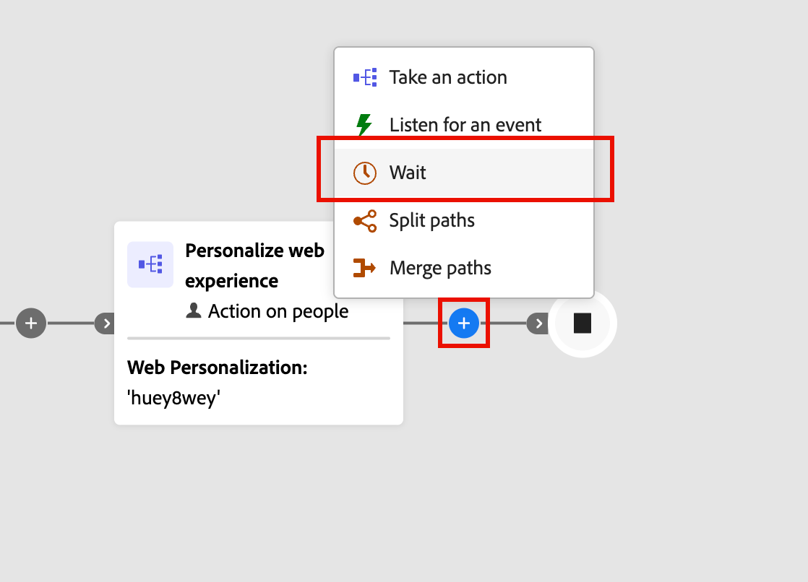

# 等待節點

當您想要在移到下一個步驟之前暫停歷程進行特定期間時，請使用&#x200B;_等待_&#x200B;節點。

定義等待時間的方式有兩種：

* 相對持續時間（分鐘數、小時數、天數、周數或月數）
* 您要前進到歷程中下一個節點的特定日期

_若要定義帳戶歷程的等待節點：_

1. 導覽至歷程圖。

1. 按一下路徑上的加號( **+** )圖示，然後選擇&#x200B;**[!UICONTROL 等待]**。

   {width="400"}

1. 在右側的節點屬性中，設定在歷程繼續前往路徑中的下一個節點之前等待的時間的&#x200B;**[!UICONTROL 型別]**。

   {width="700" zoomable="yes"}
