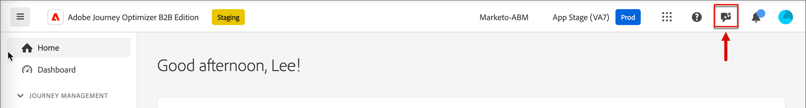
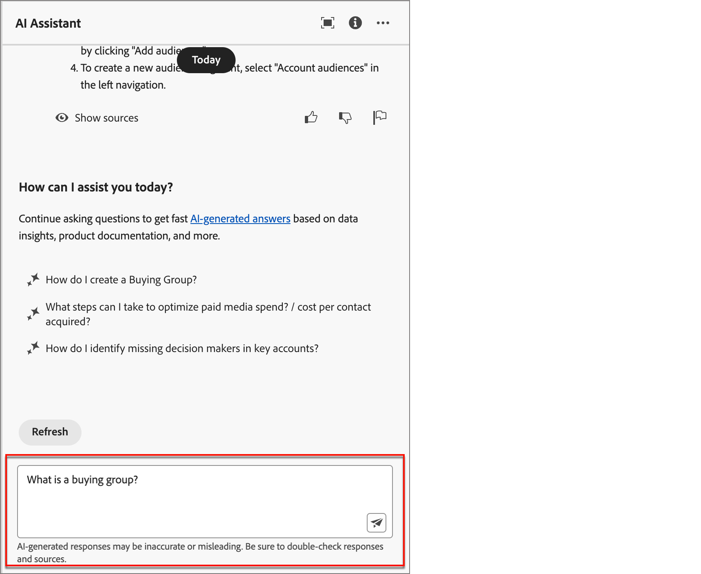
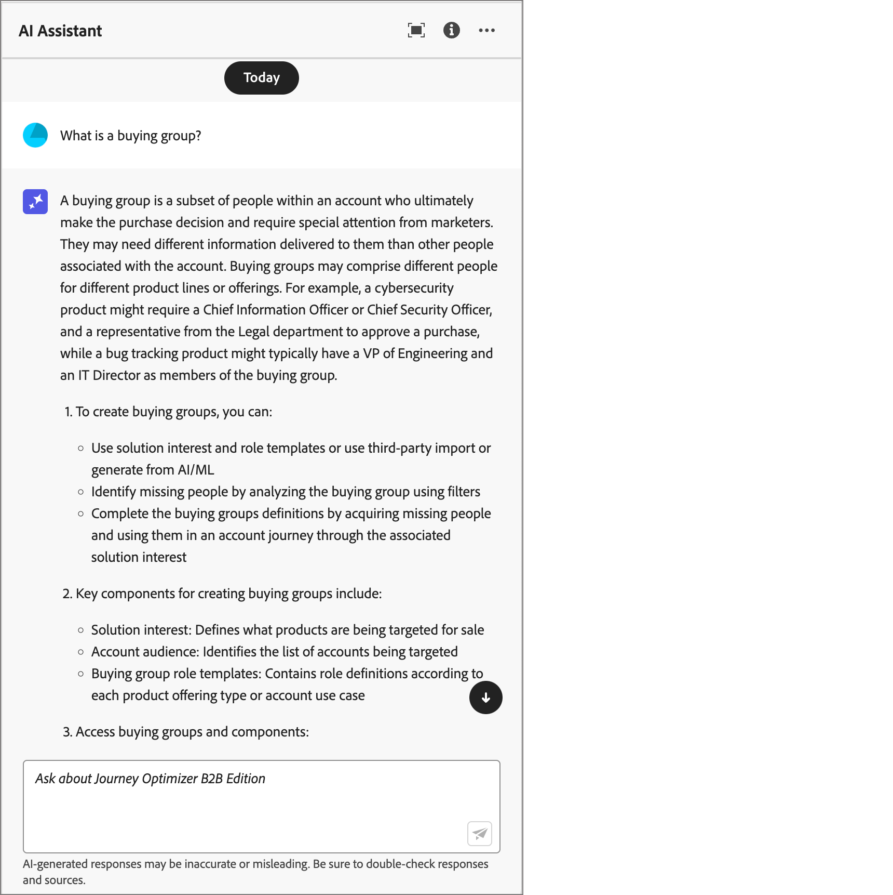

# 使用AI助理

在Journey Optimizer B2B Edition中，AI Assistant是使用者介面功能，可用來瞭解帳戶型行銷概念，並快速導覽和瞭解Journey Optimizer B2B Edition功能<!-- get operational insights for your specific environment -->。 Adobe Experience Cloud的多個產品中也提供此功能。

若要存取AI助理，請按一下標題中的圖示。 AI助理會在右側的面板中開啟。

{width="600" zoomable="yes"}

>[!IMPORTANT]
>
>您必須先取得Adobe Experience Cloud Generative AI使用者指南的合約，才能使用AI助理。 如需有關本合約及使用方法的詳細資訊，請參閱[Adobe Experience Cloud Generative AI使用准則](https://www.adobe.com/legal/licenses-terms/adobe-dx-gen-ai-user-guidelines.html)。

在Adobe Journey Optimizer B2B Edition中，AI Assistant支援下列使用案例：

* **產品知識** (Beta)

  產品知識問題是關於Journey Optimizer B2B Edition概念(與Adobe Journey Optimizer各方面相關)。 產品知識問題的一些範例包括：

   * 如何設定SMS提供者帳戶？
   * 如何在帳戶歷程中傳送電子郵件？
   * 如何個人化我的電子郵件內容？

<!-- 
* **Operational insights** in journeys (Beta)

    Operational insight questions are about the journey objects in your organization's sandbox. Some examples of operational insight questions or prompts include:

    * How many live journeys do I have in Adobe Journey Optimizer?
    * Give me a list of all the scheduled journeys
    * How many Journeys have been created in the last 7 days?

    >[!NOTE]
    >
    >The only Adobe Journey Optimizer B2B Edition object you have access to ask the AI Assistant operational insights questions about is **Journeys**. It will only have data for the sandbox you are currently in.
-->
若要提出問題，請在面板底部的欄位中輸入，然後按Enter鍵。

{width="450" zoomable="yes"}

檢查答案，並使用&#x200B;**顯示來源**&#x200B;按鈕取得產品檔案的直接連結，並瞭解更多資訊。

{width="450" zoomable="yes"}

使用向上或向下縮圖來評定答案的品質。

若要瞭解如何使用AI助理，請參閱您可以使用AI助理完成的目標範例，並瞭解AI助理的運作方式，請參閱[Adobe Experience Platform檔案](https://experienceleague.adobe.com/en/docs/experience-platform/ai-assistant/home){target="_blank"}。
