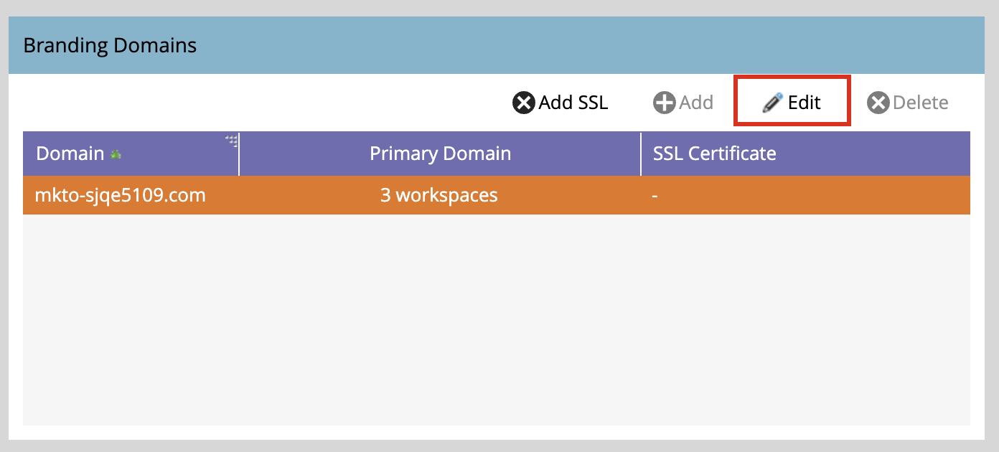

# 設定品牌化網域

Marketo Engage中的品牌化網域是自訂子網域（例如`links.yourcompany.com`），用於重寫連結及追蹤電子郵件點按，並確保其反映您的品牌，而非一般網域。 每個品牌化網域都會當作點選追蹤網域，將您的電子郵件和登陸頁面連結配對至網域，以增強傳遞能力與信任。

* 它以您自己的電子郵件超連結品牌來取代一般連結。
* 帳戶潛在客戶按一下連結時，會透過此自訂網域重新導向，以便在對電子郵件篩選器顯示合法性的情況下允許效能追蹤。
* 如果您有多個品牌，您可以設定其他品牌網域，以支援不同的業務單位或品牌。

>[!BEGINSHADEBOX]

**追蹤連結的唯一CNAME**

電子郵件追蹤連結必須是新連結，且對於附加的Marketo Engage例項而言必須是唯一的。 如果您有追蹤連結的現有CNAME指向既存的（生產） Marketo Engage執行個體，則這些連結無法以&#x200B;_原樣_&#x200B;重複使用。

您可以在生產Marketo Engage執行個體和附加的執行個體之間共用傳迴路徑網域品牌，但這是後端變更。 開啟支援票證，並提供您的Marketo Engage前置詞(Munchkin ID)和新的Journey Optimizer B2B edition前置詞(Munchkin ID)，申請共用傳迴路徑網域名稱。

>[!ENDSHADEBOX]

>[!PREREQUISITES]
>
>在UI中編輯或新增網域之前，您必須將[對應的CNAME對應至Adobe提供的Marketo Engage網域](https://experienceleague.adobe.com/zh-hant/docs/marketo/using/getting-started/initial-setup/setup-steps#customize-your-landing-page-urls-with-a-cname){target="_blank"}。
>
>新增網域時，系統會檢查預先存在的SSL，這些SSL可能在之前已手動建立。 如果您遇到此驗證，請在不選取SSL建立的情況下建立您的網域，然後將它們連線為單獨的程式。

## 存取Marketo Engage中的品牌化網域

1. 移至Marketo Engage執行個體中的&#x200B;**[!UICONTROL 管理員]**&#x200B;區域並選取&#x200B;**[!UICONTROL 電子郵件]**。

1. 向下捲動至&#x200B;**[!UICONTROL 品牌化網域]**&#x200B;面板。

   ![在電子郵件底下的[管理員]中的[品牌化網域]面板，顯示預設網域](./assets/me-admin-email-branding-domains.png){width="700" zoomable="yes"}

   此清單會顯示Marketo Engage執行個體的預設網域。

## 編輯您的預設品牌化網域

使用品牌領域的第一步是編輯在Marketo Engage執行個體中定義的預設品牌領域。

>[!NOTE]
>
>您必須先編輯一般預設領域，才能定義其他品牌領域。

1. 在&#x200B;_[!UICONTROL 品牌化網域]_&#x200B;面板中，選取一般網域並按一下頂端的&#x200B;**[!UICONTROL 編輯]**。

   {width="500"}

1. 在&#x200B;_[!UICONTROL 編輯品牌化網域]_&#x200B;對話方塊中，於&#x200B;**[!UICONTROL 網域]**&#x200B;欄位中輸入預設網域的名稱。

   {width="400"}

1. 如果您為Marketo Engage執行個體定義了多個工作區，請按一下[下一步] **&#x200B;**。

   選取您想要套用更新主網域的每個工作區。

   {width="400"}

1. 按一下&#x200B;**[!UICONTROL 儲存]**。

## 定義其他網域

編輯預設網域後，當您想要在Journey Optimizer B2B edition環境中執行多個品牌時（每個品牌都有自己的品牌追蹤連結），可以新增另一個品牌網域。 當您新增領域時，您有以下選項：

>* _設為主要網域_：將這個設為工作區的主要網域。 當您選取此選項時，所有現有的未傳送電子郵件都會設定為預設主要網域，而所有新建立的電子郵件都會自動預設為此主要網域。 行銷人員可視需求選擇替代品牌領域。
>
>* _產生SSL憑證_：建立網域以建立安全通訊端層(SSL)。 第一個追蹤網域會起始一次性的基礎結構設定，可能需要幾個小時的時間。 系統會在完成時傳送通知。

新增網域&#x200B;:_(_T)

1. 在&#x200B;_[!UICONTROL 品牌化網域]_&#x200B;面板中，按一下頂端的&#x200B;**[!UICONTROL 新增]**。

   ![品牌化網域面板，頂端有[新增]按鈕](assets/me-admin-email-branding-domains-add.png){width="500"}

1. 在&#x200B;_[!UICONTROL 新品牌化網域]_&#x200B;對話方塊中，於&#x200B;**[!UICONTROL 網域]**&#x200B;欄位中輸入品牌化網域的名稱。

1. （選擇性）選取&#x200B;**[!UICONTROL 產生SSL憑證]**&#x200B;核取方塊以自動產生網域的SSL。

   {width="400"}

   如有需要且可用，您也可以選取&#x200B;_建立主要網域_&#x200B;核取方塊。

   >[!NOTE]
   >
   >**_自訂SSL_**：如果您需要自訂SSL，可以提交[支援票證](https://nation.marketo.com/t5/support/ct-p/Support){target="_blank"}。 請勿在建立SSL時使用核取方塊。

1. 如果您為Marketo Engage執行個體定義了多個工作區，請按一下[下一步] **&#x200B;**。

   如有需要，請選取您要將新領域套用為主要領域的每個工作區。

   {width="400"}

1. 按一下&#x200B;**[!UICONTROL 儲存]**。

## 編輯現有品牌領域的SSL

請依照下列步驟，為您現有的網域啟用SSL。

1. 從&#x200B;_[!UICONTROL 管理員]_&#x200B;區域，選取&#x200B;**[!UICONTROL 電子郵件]**。

1. 在&#x200B;_[!UICONTROL 品牌化網域]_&#x200B;面板中，選取網域列並按一下&#x200B;**[!UICONTROL 新增SSL]**。

   {width="500"}

1. 在對話方塊中，按一下&#x200B;**[!UICONTROL 確認]**。

   {width="400"}

## 錯誤訊息

| 錯誤 | 詳細資料 |
| ----- | ------- |
| `Domain already exists.` | 已有相同名稱的網域存在。 |
| `Domain is not mapped to the default domain.` | 自訂網域未正確對應到預設網域。 驗證網域對應設定，並確定DNS設定指向正確的預設網域。 |
| `SSL certificates could not be issued due to unsupported CAA records. Request your IT to update your CAA records.` | CAA記錄不是最新的。 若是使用Adobe管理的SSL憑證，CAA記錄必須更新為廠商建議的憑證。 |
| `SSL certificate has already been issued.` | 此自訂網域已存在SSL憑證。 除非憑證已過期或需要重新核發，否則不需要進一步動作。 |
| `The default domain was not found. Please contact Support for assistance.` | 嘗試尋找預設網域時發生問題。 聯絡Adobe支援以觸發調查。 |
| `Unexpected error encountered while creating a domain. Please contact Support for assistance.` | 發生非預期的錯誤。 收集紀錄和錯誤詳細資料，然後將問題升級至Adobe支援。 |

## 刪除品牌化網域

>[!NOTE]
>
>如果您想要刪除主要品牌領域（在一或多個工作區中），您必須先選取不同的品牌領域作為每個工作區的主要品牌領域。
>
>刪除網域&#x200B;**_不會_**&#x200B;刪除SSL憑證。 此護欄可防止使用者發生導致網站沒有SSL憑證的錯誤。 如果您確實要移除SSL憑證，請聯絡Adobe支援。

在&#x200B;_[!UICONTROL 品牌化網域]_&#x200B;面板中，選取網域，然後按一下頂端的&#x200B;**[!UICONTROL 刪除]**。
